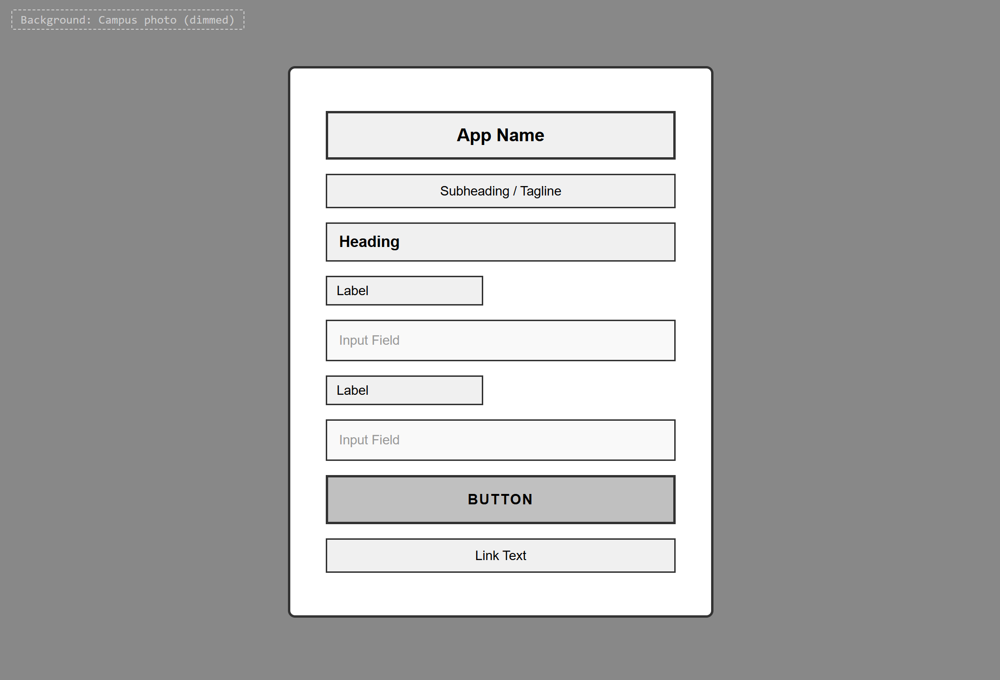
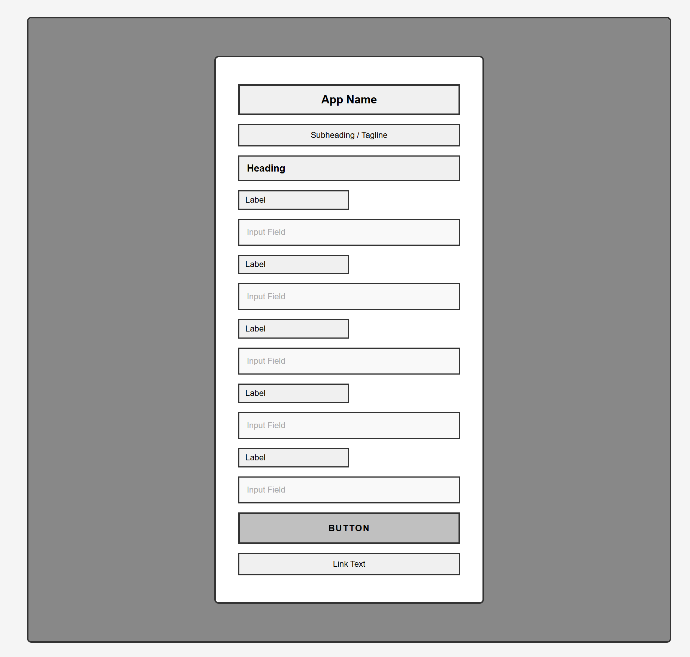
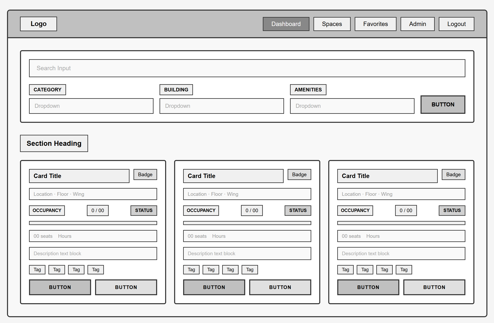
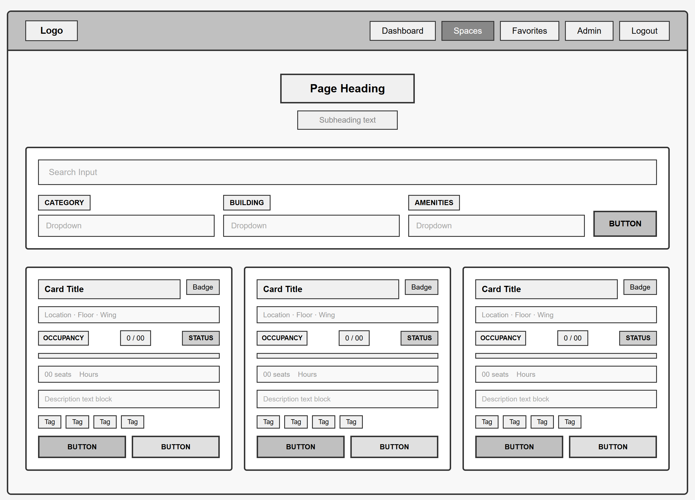
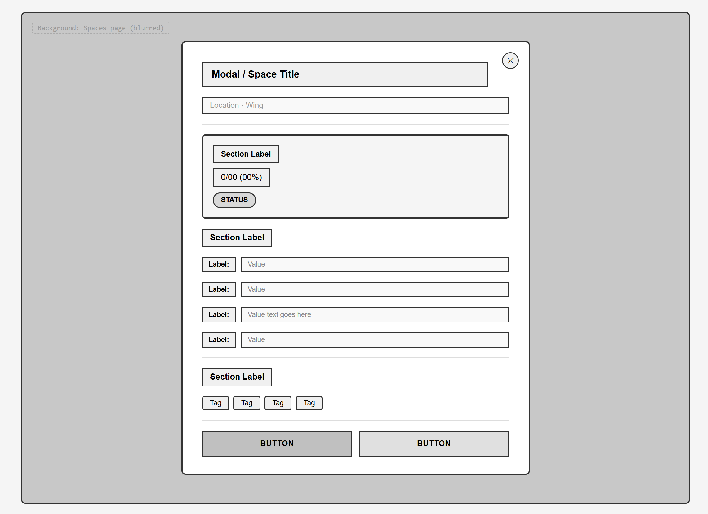
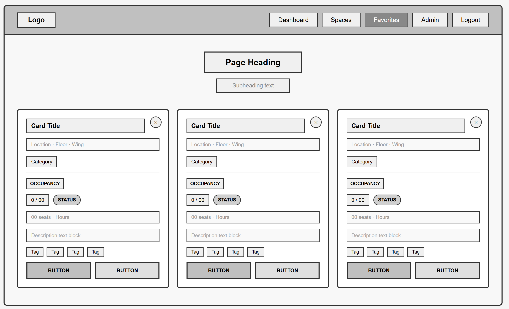
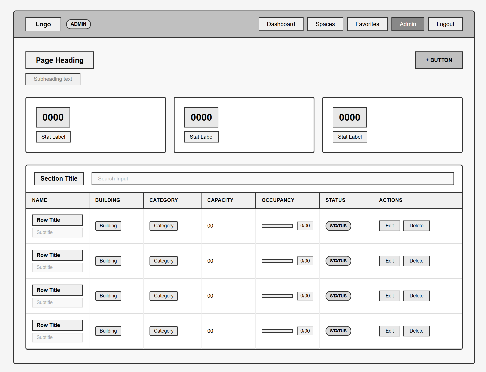

# SpotCheck - Design Document

## Project Information

- **Project Name:** SpotCheck
- **Team Members:**
  - Rachit Patel (Spaces & Check-ins)
  - Prajakta Avachat (Users & Favorites)
- **Course:** Web Development Project 2
- **Technology Stack:** Node.js, Express, MongoDB, Vanilla JavaScript

---

## 1. Project Description

### Project Name

**SpotCheck - Real-time campus study space availability tracker**

### Team Members

- **Rachit Patel** - Implementing Spaces & Check-ins collections with full CRUD
- **Prajakta Avachat** - Implementing Users & Favorites collections with full CRUD

### Short Description

Students waste 15-30 minutes daily walking across campus searching for available study spots, especially during midterms and finals when libraries are packed. SpotCheck solves this by crowdsourcing real-time occupancy data through user check-ins, showing live availability before students leave their dorm. Our system provides color-coded availability indicators (12/30 seats occupied) updated in real-time as students check in and out. Students can filter spaces by amenities (outlets, WiFi, whiteboards), category, and building location, plus save their favorites for quick access, eliminating wasted trips across campus.

### Technical Independence

**Rachit's Work:**

- **Spaces collection** - name, location, capacity, amenities, currentOccupancy, category, hours
- **Check-ins collection** - userId reference, spaceId, checkInTime, checkOutTime, isActive
- Fully functional for browsing, filtering, and checking in/out

**Prajakta's Work:**

- **Users collection** - name, email, password, favorites array with spaceId references, currentlyStudyingAt
- Full authentication system
- Fully functional for user management and favorites

---

## 2. User Personas

### Persona 1: Sarah

**Computer Science junior who needs quiet spaces with outlets for 4-hour coding sessions**

**Demographics:**

- Age: 21
- Year: Junior
- Major: Computer Science
- Study Habits: 4-hour coding sessions, needs reliable power and quiet environment

**Goals:**

- Find quiet spaces with reliable power outlets
- Avoid loud environments that break concentration
- Minimize time spent searching for study spots
- Discover new productive study locations

**Pain Points:**

- Laptop dies when outlets aren't available
- Loses 20-30 minutes walking to full libraries
- Prefers quiet spaces but library is often too crowded
- Doesn't know about all the study spaces on campus

**How SpotCheck Helps:**

- Filter for spaces with outlets before leaving dorm
- Check real-time availability to avoid wasted trips
- Save favorite quiet spots for quick access
- Discover lesser-known study spaces with her preferred amenities

**Typical User Journey:**

1. Opens SpotCheck at 2 PM to start coding session
2. Filters for "Library" + "Outlets" + "Quiet"
3. Sees Main Library 3rd Floor is 80% full (24/30 occupied)
4. Checks her favorites - Snell Engineering Quiet Room shows 40% full (6/15)
5. Heads to Snell, checks in upon arrival
6. Studies for 4 hours, checks out when leaving

---

### Persona 2: Marcus

**Freshman unfamiliar with campus, wants to discover new study spots near his classes**

**Demographics:**

- Age: 18
- Year: Freshman
- Major: Undeclared
- Study Habits: Short study sessions between classes, exploring campus

**Goals:**

- Discover study spaces near his classes
- Learn which spaces are best for different needs
- Find spaces that are open late when he has night classes
- Build a mental map of campus study options

**Pain Points:**

- Unfamiliar with campus geography
- Doesn't know where study spaces are located
- Unsure which spaces are actually good for studying
- Has limited time between classes to search for spaces

**How SpotCheck Helps:**

- Browse all available spaces by building/location
- View space details including photos and amenities
- See which 24/7 spaces are actually open late
- Build a favorites list as he discovers good spots

**Typical User Journey:**

1. Finishes chemistry class at 11 AM in Science Building
2. Has 2-hour gap before next class
3. Opens SpotCheck, filters by "Near Science Building"
4. Discovers Science Library Collaboration Room (5/20 occupied)
5. Views space details - has whiteboards for practice problems
6. Adds to favorites for future use
7. Checks in and studies

---

### Persona 3: Priya

**Graduate student leading group projects, needs spaces with whiteboards and group seating**

**Demographics:**

- Age: 24
- Year: Graduate Student
- Major: Business/Engineering
- Study Habits: Frequent group meetings, collaborative work sessions

**Goals:**

- Find spaces that accommodate 4-6 people
- Ensure spaces have whiteboards for brainstorming
- Book spaces with good WiFi for presentations
- Coordinate with team members on location

**Pain Points:**

- Group rooms are often fully booked
- Walking to spaces only to find them occupied
- Team members scattered across campus
- Needs specific amenities (whiteboards, projectors)

**How SpotCheck Helps:**

- Filter for group spaces with required amenities
- Check real-time availability before team arrives
- Share space information with team members
- Save favorite group study locations

**Typical User Journey:**

1. Team meeting scheduled for 3 PM
2. Opens SpotCheck at 2:45 PM
3. Filters for "Group Space" + "Whiteboard" + "6+ capacity"
4. Finds Curry Student Center Study Room (2/8 occupied)
5. Messages team with location
6. Checks in when team arrives
7. Team uses whiteboard for project planning

---

### Persona 4: Alex

**Night owl studying until 2 AM, needs to know which 24/7 spaces are actually open**

**Demographics:**

- Age: 20
- Year: Sophomore
- Major: Architecture/Engineering
- Study Habits: Late-night study sessions, prefers quiet campus hours

**Goals:**

- Find 24/7 spaces that are actually open late
- Avoid walking to closed buildings at night
- Find safe, well-lit spaces for late-night studying
- Access spaces with outlets for all-night work sessions

**Pain Points:**

- Many "24/7" spaces are actually locked at night
- Campus feels empty - hard to know what's open
- Wastes time walking to closed buildings
- Prefers studying when campus is less crowded

**How SpotCheck Helps:**

- Filter for 24/7 spaces and see current availability
- Check real-time status to confirm spaces are open
- View space hours before making the trip
- See which late-night spots have other students

**Typical User Journey:**

1. Starts architecture project at 11 PM
2. Opens SpotCheck to find open spaces
3. Filters for "24/7" + "Outlets"
4. Sees Snell Library 24/7 Room (3/20 occupied)
5. Confirms it's currently open with active check-ins
6. Walks over and checks in
7. Works until 2 AM, checks out when leaving

### Persona 5: Jordan

**Part-time student balancing work and classes, needs to find spaces quickly during short breaks**

**Demographics:**

- Age: 23
- Year: Senior
- Major: Business Administration
- Study Habits: Short 30-60 minute sessions between work shifts and classes

**Goals:**

- Find available spaces instantly without wasting break time searching
- Locate spaces close to wherever they currently are on campus
- Check out quickly when their break ends

**Pain Points:**

- Very limited time between work and class commitments
- Can't afford to walk across campus only to find spaces full
- Needs spaces that are available right now, not in 30 minutes

**How SpotCheck Helps:**

- See real-time availability before leaving current location
- Filter by building to find nearby spaces fast
- Quick check-in and check-out process

**Typical User Journey:**

1. Gets a 45-minute break between work shift and class
2. Opens SpotCheck immediately and filters by nearest building
3. Finds Student Union lounge (3/10 occupied)
4. Checks in, studies for 40 minutes
5. Checks out and heads to class

---

### Persona 6: Dr. Kim

**Faculty advisor who recommends SpotCheck to students and wants accurate space data**

**Demographics:**

- Age: 45
- Role: Academic Advisor / Faculty
- Department: College of Engineering

**Goals:**

- Recommend reliable study spaces to advisees during busy exam periods
- Trust that occupancy data shown is accurate and up to date
- Ensure the tool benefits students across all departments

**Pain Points:**

- Students frequently complain about not finding study spaces during finals
- Existing campus maps are outdated and don't show real-time availability
- No way to verify which spaces are actually open and available

**How SpotCheck Helps:**

- Recommend SpotCheck to students as a reliable resource
- Trust crowdsourced real-time data from active check-ins
- Point students to specific buildings and space types for their needs

**Typical User Journey:**

1. Student mentions struggling to find study space during advising session
2. Dr. Kim recommends SpotCheck and walks them through filtering by building
3. Together they find an available space near the student's next class
4. Student checks in successfully, Dr. Kim bookmarks the tool for future advising sessions

---

## 3. User Stories

### Rachit's Implementation (Spaces & Check-ins)

**US-1: Browse and Filter Study Spaces**

> _As a student, I want to browse all study spaces on campus and filter them by amenities (outlets, WiFi, whiteboards) and category (library, cafe, lounge), so I can find spots that match my specific needs._

**Acceptance Criteria:**

- All spaces displayed in grid/card layout with name, building, category, and current occupancy
- Filter options include: outlets, WiFi, whiteboards, quiet, group-friendly
- Category filters: library, cafe, lounge, study room, outdoor
- Multiple amenities can be selected simultaneously
- Results update in real-time as filters are applied
- Clear filters button resets all selections
- Spaces have color-coded availability indicators (Green <60%, Yellow 60-85%, Red >85%)

---

**US-2: View Real-Time Occupancy and Space Details**

> _As a student, I want to see real-time occupancy (12/30 seats) and view detailed space information (capacity, amenities, hours, location), so I don't waste time walking to full locations and can decide if a space is right for me before visiting._

**Acceptance Criteria:**

- Occupancy displayed as "X/Y" format (current/total) with percentage
- Color coding updates based on occupancy level
- Clicking a space card opens detailed view
- Detail page shows: capacity, current occupancy, amenities list, hours, location, description, photos
- Shows currently checked-in user count
- Occupancy updates when users check in/out
- Back button returns to browse view

---

**US-3: Check In and Out of Spaces**

> _As a student, I want to check into a space when I arrive and check out when I leave, so I help others know it's occupied and keep occupancy data accurate for the community._

**Acceptance Criteria:**

- "Check In" button visible on space detail page (must be logged in)
- Cannot check in if already checked in elsewhere
- Check-in time is recorded and occupancy count increments immediately
- "Check Out" button visible when user is checked in
- Check-out time is recorded and occupancy count decrements
- Session duration is calculated and stored
- Success messages confirm both check-in and check-out
- Dashboard shows current check-in status with space name and duration

---

**US-4: Quick Space Discovery During Short Breaks**

> _As a part-time student with limited break time, I want to instantly find an available space near my current building using filters, so I can start studying within minutes without wasting my short breaks searching._

**Acceptance Criteria:**

- Filter by building returns only spaces in that building
- Occupancy data reflects current real-time status
- Search and filter results load within 2 seconds
- Check-in process completes in a single click
- Check-out is equally fast and updates occupancy immediately
- Color-coded status badges reflect actual current occupancy

---

### Prajakta's Implementation (Users & Favorites)

**US-5: Create Account and Login Securely**

> _As a student, I want to create an account with my information and log in securely, so I can save favorites, check into spaces, and have my data protected._

**Acceptance Criteria:**

- User can register with name, email, password, major, and graduation year
- Email must be unique in the system
- Password is securely hashed before storage
- User can log in with valid email and password credentials
- JWT token is generated and stored upon successful login
- Invalid credentials display clear error messages
- Success message confirms account creation
- User is redirected to dashboard after login
- Session persists across page refreshes
- Logout button clears JWT token and redirects to login page

---

**US-6: Add and Remove Spaces from Favorites**

> _As a student, I want to add spaces to my favorites list and remove them when my preferences change, so I can quickly access the spots I actually use without searching every time._

**Acceptance Criteria:**

- Heart/star icon visible on all space cards and detail pages
- Clicking empty icon adds space to favorites with visual feedback
- Clicking filled icon removes space from favorites
- Duplicate favorites are prevented
- Changes reflect immediately across all views
- Favorites list updates in real-time
- Success messages confirm additions and removals

---

**US-7: View All Favorites with Real-Time Availability**

> _As a student, I want to view all my favorite spaces in one dedicated page with their current availability, so I can quickly choose where to study today and check in directly from my favorites._

**Acceptance Criteria:**

- Dedicated "Favorites" page accessible from main navigation
- All favorited spaces displayed in grid layout
- Each favorite card shows real-time occupancy with color coding
- Empty state message shown when user has no favorites
- Quick "Check In" button on each favorite card for one-click check-in
- Ability to remove spaces from favorites directly on this page
- Page updates automatically when spaces are added or removed from favorites
- Real-time occupancy updates for all favorite spaces

---

**US-8: Quick Account Setup and Favorites for Returning Users**

> _As a part-time student with limited time, I want to register quickly, save my frequently used spaces to favorites, and check in directly from the favorites page, so I don't have to search every time I have a short break._

**Acceptance Criteria:**

- Registration form is simple and completes in under a minute
- Favorites are saved to the user's account and persist across sessions
- User can check in directly from the Favorites page in one click
- Favorites page loads with current real-time occupancy for each saved space
- User remains logged in across page refreshes via JWT token

---

## 4. Design Mockups

### 4.1 Login Page

**Layout Description:**

- **Background**: Full-screen blurred campus photo
- **Card**: Centered white card with app name and tagline at the top
- **Form Fields**: Email and password input fields with placeholder text
- **Primary Button**: Full-width login button
- **Footer Link**: Link to registration page for new users

---

### 4.2 Registration Page

**Layout Description:**

- **Background**: Full-screen blurred campus photo (same as login)
- **Card**: Centered white card with app name and tagline at the top
- **Form Fields**: Full name, email, password, major, and graduation year inputs
- **Primary Button**: Full-width register button
- **Footer Link**: Link back to login page for existing users

---

### 4.3 Dashboard / Home Page

**Layout Description:**

- **Navigation Bar**: Fixed header with logo on left, nav links (Dashboard, Spaces, Favorites, Admin, Logout) on right with active state indicator
- **Search Bar**: Full-width search input at the top of the content area
- **Filter Panel**: Three dropdowns (Category, Building, Amenities) in a row with a Clear Filters button
- **Space Cards**: 3-column grid of cards each showing title, category badge, location, occupancy count with color-coded progress bar, seat count, hours, description, amenity tags, and two action buttons (Check In, Add Favourite)

---

### 4.4 Space Page

**Layout Description:**

- **Navigation Bar**: Fixed header with Spaces active in nav links
- **Page Heading**: Centered title and subheading above the filter panel
- **Search Bar**: Full-width search input
- **Filter Panel**: Three dropdowns (Category, Building, Amenities) with a Clear Filters button
- **Space Cards**: 3-column grid identical to the dashboard with title, badge, location, occupancy, amenity tags, and View Details / Add Favourite buttons

---

### 4.5 Space Details Page

**Layout Description:**

- **Background**: Spaces page visible behind a dimmed overlay
- **Modal**: Centered white modal with a close (✕) button in the top-right corner
- **Header**: Space name as title and location/wing as subtitle
- **Occupancy Box**: Highlighted section showing current count (X/Y %), percentage, and color-coded status badge
- **About Section**: Label-value rows for Category, Capacity, Description, and Hours
- **Amenities Section**: Pill-shaped amenity tags in a row
- **Action Buttons**: Two full-width buttons at the bottom (Check In Here, Add Favourite)

---

### 4.6 Favorites Page

**Layout Description:**

- **Navigation Bar**: Fixed header with Favorites active in nav links
- **Page Heading**: Centered title and subheading
- **Space Cards**: 3-column grid of favorited spaces, each with a ✕ remove button in the top-right corner
- **Card Content**: Space title, location, category, occupancy with status badge, seat count, description, amenity tags, and Check In / View Details buttons

---

### 4.7 Admin Page

**Layout Description:**

- **Navigation Bar**: Fixed header with ADMIN badge next to the logo and Admin active in nav links
- **Page Header**: Left-aligned page title and subheading with a "+ Add New Space" button on the right
- **Stats Row**: Three stat cards in a row showing Total Spaces, Total Capacity, and Available Now
- **Table Panel**: Searchable table with columns for Name, Building, Category, Capacity, Occupancy (progress bar + count), Status badge, and Edit / Delete action buttons per row

## 5. Color Scheme & Design System

### Brand Colors

- **Primary:** #2563EB (Blue) - Main brand color, buttons, links
- **Secondary:** #10B981 (Green) - Success, available spaces
- **Warning:** #F59E0B (Yellow) - Filling up spaces
- **Danger:** #EF4444 (Red) - Full/nearly full spaces
- **Neutral:** #6B7280 (Gray) - Text, borders

### Availability Color Coding

- 🟢 **Green (<60% full):** #10B981 - "Good availability"
- 🟡 **Yellow (60-85% full):** #F59E0B - "Filling up"
- 🔴 **Red (>85% full):** #EF4444 - "Nearly full / Full"

### Typography

- **Headings:** Inter, sans-serif (Bold, 24-32px)
- **Body:** Inter, sans-serif (Regular, 14-16px)
- **Labels:** Inter, sans-serif (Medium, 12-14px)

### Spacing

- **Card Padding:** 16px
- **Card Gap:** 20px
- **Section Margin:** 32px
- **Button Padding:** 12px 24px

### Components

- **Cards:** Rounded corners (8px), subtle shadow
- **Buttons:** Rounded (6px), solid colors, hover effects
- **Icons:** 20px standard size, 16px for inline
- **Inputs:** Border radius 4px, focus state with blue outline

---

## 6. Technical Architecture Overview

### Frontend Stack

- **HTML5** - Semantic markup
- **CSS3** - Modular stylesheets (one per component)
- **Vanilla JavaScript** - Client-side rendering, no frameworks
- **ES6 Modules** - Code organization

### Backend Stack

- **Node.js** - Runtime environment
- **Express.js** - Web framework
- **MongoDB (Native Driver)** - Database (NO Mongoose!)
- **JWT** - Authentication
- **bcrypt** - Password hashing

### API Structure

- RESTful endpoints
- JSON responses
- JWT-based authentication
- Error handling middleware

### Database Collections

1. **users** - User accounts and favorites
2. **spaces** - Study space information
3. **checkins** - Check-in/out records

---

## 7. Success Metrics

### User Engagement

- Daily active users
- Average check-ins per user
- Favorite spaces per user
- Session duration

### System Performance

- Real-time occupancy accuracy
- Average time to find a space
- Check-in/out success rate
- Page load times

### User Satisfaction

- Time saved per user (vs. walking around)
- Percentage of successful space finds
- Return user rate
- Feature usage statistics

---

## 8. Future Enhancements (Post-MVP)

### Phase 2 Features

- Push notifications for favorite space availability
- Space reservation system (1-hour slots)
- Study group formation and coordination
- Building floor maps with space locations
- Mobile app (iOS/Android)

### Phase 3 Features

- Integration with campus calendar/events
- Quiet hours enforcement tracking
- Study space reviews and ratings
- Analytics dashboard for administrators
- Predictive availability based on historical data

### Phase 4 Features

- Integration with campus ID card check-ins
- Automated occupancy sensors
- Multi-campus support
- API for third-party integrations
- Social features (study buddies, group study matching)

---

## 9. Team Responsibilities

### Rachit Patel

**Backend:**

- Spaces collection and CRUD operations
- Check-ins collection and logic
- Space filtering and search APIs
- Admin space management

**Frontend:**

- Space browsing page
- Space detail page
- Check-in/out UI components
- Filter and search interface

### Prajakta Avachat

**Backend:**

- Users collection and authentication
- Favorites system APIs
- User profile management
- JWT token handling

**Frontend:**

- Login/registration pages
- Favorites page
- Profile page
- Navigation and header components

### Shared Responsibilities

- Code reviews
- Testing
- Documentation
- Deployment
- Video demo creation

---
